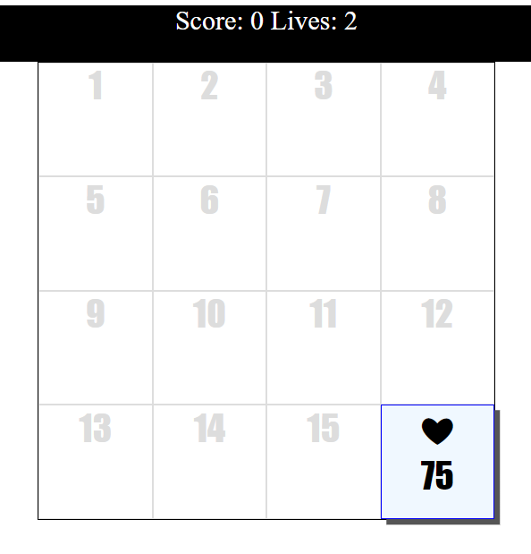

# Click-Popper-Game
Create a fun interactive DOM based game with JavaScript. Click only + items as they show up, see how much you can score in the time provided.

# Features
- Use only JavaScript to create the gameboard.
- Player scoring and element values.
- Game play timer - setTimeout.
- Math random for random position
- Click tracking for hits of element.

# Image

